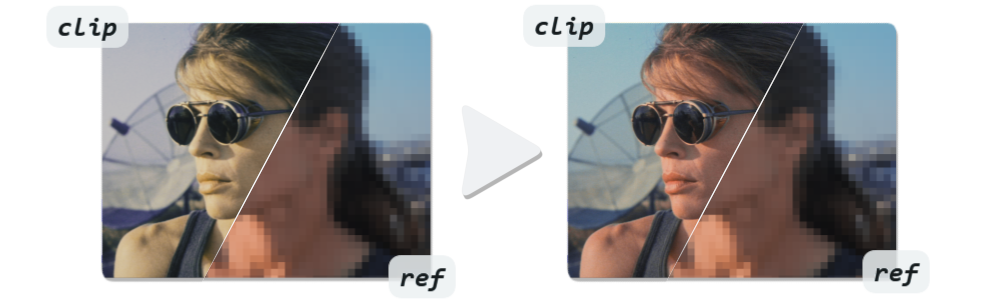

# Color Fix functions for VapourSynth

For example for fixing color shift from AI upscaling/restoration models, or transfering color grading from an old release to a remaster. Also known as Color Transfer or Color Matching. See this collection of [Comparisons](https://slow.pics/c/abXjnKn3).

<p align="center">
  <a href="https://slow.pics/c/abXjnKn3">
    
  </a>
</p>


### Requirements
The Average Color Fix will work without these. For the Wavelet Color Fix, you only need to install the backends you intend to use. Check the backend parameter docs and benchmarks below for more information.
* [vs-mlrt with NCNN, DirectML, or TensorRT](https://github.com/AmusementClub/vs-mlrt) *(optional GPU backends in Wavelet Color Fix)*
* [vapoursynth-ATWT](https://github.com/yuygfgg/Vapoursynth-ATWT) *(optional CPU backend in Wavelet Color Fix)*
* [vszip](https://github.com/dnjulek/vapoursynth-zip) *(optional speed boost for Average Color Fix)*

### Setup
Install/update via pip: `pip install -U git+https://github.com/pifroggi/vs_colorfix.git`  
Or put the entire `vs_colorfix` folder into your vapoursynth scripts folder.

<br />

## Average Color Fix
Fixes color shift by matching the average color of a clip to a reference clip. A very fast way to transfer the colors from one clip to another that has close to the same content. For large color differences, the Wavelet Color Fix is more accurate. 

```python
import vs_colorfix
clip = vs_colorfix.average(clip, ref, radius=10, planes=[0, 1, 2], fast=False)
```

__*`clip`*__  
Clip where the colors will be applied to. Recommended higher than 8-bit avoid banding.

__*`ref`*__  
Reference clip where the colors are taken from. Recommended higher than 8-bit avoid banding.

__*`radius`*__  
Higher means a more global color match and wider bloom/bleed.  
Lower means a more local color match and smaller bloom/bleed. Too low and the reference clip will become visible.  
Test values 5 and 30 and this will become more clear.

__*`planes`* (optional)__  
Which planes to color fix. Any unmentioned planes will simply be copied.  
If not set, all planes will be color-fixed.

 __*`fast`* (optional)__  
Does the averaging via a downscale instead of a blur, which is much faster, but will produce faint blocky artifacts.  
I found it useful for radius > 60 where artifacts are no longer noticable, or to fix something like a prefilter clip.

> [!TIP]
> * If your clips are not sufficiently aligned or synchronized, use [vs_align](https://github.com/pifroggi/vs_align) to align them first.
> * To replicate chaiNNers Average Color Fix, you can convert % to radius: `radius = (100/percentage-1)/2`  
>   ChaiNNer works like fast=True does here, but it is recommended to leave it off for better results.

<br />

## Wavelet Color Fix
Fixes color shift by first converting into wavelets, then matching the average color of a clip to a reference clip. Works similarly to the Average Color Fix, but more accurate with large color differences at the cost of more computation. Both clips must have close to the same content.

```python
import vs_colorfix
clip = vs_colorfix.wavelet(clip, ref, wavelets=4, planes=[0, 1, 2], backend="ncnn", num_streams=2, gpu_id=0, engine_folder=None)
```

__*`clip`*__  
Clip where the colors will be applied to. Recommended higher than 8-bit avoid banding.

__*`ref`*__  
Reference clip where the colors are taken from. Recommended higher than 8-bit avoid banding.

__*`wavelets`*__  
Number of wavelets in the range 1-10. 3-5 seems to work best in most cases.  
Higher means a more global color match and wider bloom/bleed.  
Lower means a more local color match and smaller bloom/bleed. Too low and the reference clip will become visible.  
Test values 3 and 8 and this will become more clear.

__*`planes`* (optional)__  
Which planes to color fix. Any unmentioned planes will simply be copied.  
If not set, all planes will be color-fixed.

__*`backend`* (optional)__  
The backend used to run the color fix. **16-bit float input is always much faster on GPU, but not supported by older GPUs.**
* `cpu` CPU mode using the Vapoursynth-ATWT plugin (slow).
* `ncnn` GPU mode using vs-mlrt with NCNN support. Works on almost any GPU, even MAC (fast).
* `directml` GPU mode using vs-mlrt with DirectML support. Works on most GPUs, Windows only (fast).
* `tensorrt` GPU mode using vs-mlrt with TensorRT support. Requires an Nvidia RTX GPU. On the first run, this mode will automatically build an engine, which may take a few minutes. Changing wavelets or input dimensions will trigger rebuilding, but build engines are stored *(very fast)*.

__*`num_streams`* (optional)__  
Number of parallel GPU streams. Higher can be faster, but requires more VRAM. Does not effect the CPU backend.

__*`gpu_id`* (optional)__  
GPU indes ID starting with 0 for the first compatible GPU. For example to switch between iGPU/dGPU. Does not effect the CPU backend.

__*`engine_folder`* (optional)__  
Optional path to the TensorRT engine storage location. By default engines are stored in `vs_colorfix/engines`. Only effects the TensorRT backend.

> [!TIP]
> * On low end GPUs, the NCNN backend can be faster than TensorRT and DirectML.
> * If your clips are not sufficiently aligned or synchronized, use [vs_align](https://github.com/pifroggi/vs_align) to align them first.

<br />

## Benchmarks
Benchmarks were done on a RTX 4090 GPU and a Ryzen 5900X CPU with 16-bit input clips.

<table>
  <tr>
    <td valign="top">

<table>
  <thead>
    <tr>
      <th colspan="5">Wavelet Color Fix</th>
    </tr>
    <tr>
      <th>Resolution</th>
      <th>TensorRT</th>
      <th>DirectML</th>
      <th>NCNN</th>
      <th>CPU</th>
    </tr>
  </thead>
  <tbody>
    <tr>
      <td>1440x1080</td>
      <td>~360 fps</td>
      <td>~250 fps</td>
      <td>~250 fps</td>
      <td>~20 fps</td>
    </tr>
    <tr>
      <td>2880x2160</td>
      <td>~80 fps</td>
      <td>~60 fps</td>
      <td>~60 fps</td>
      <td>~5 fps</td>
    </tr>
  </tbody>
</table>

</td>
<td valign="top">

<table>
  <thead>
    <tr>
      <th colspan="3">Average Color Fix</th>
    </tr>
    <tr>
      <th>Resolution</th>
      <th>fast=False</th>
      <th>fast=True</th>
    </tr>
  </thead>
  <tbody>
    <tr>
      <td>1440x1080</td>
      <td>~250 fps</td>
      <td>~850 fps</td>
    </tr>
    <tr>
      <td>2880x2160</td>
      <td>~60 fps</td>
      <td>~150 fps</td>
    </tr>
  </tbody>
</table>

</td>
  </tr>
</table>

<br />

## Acknowledgements
Average Color Fix idea from [chaiNNer](https://github.com/chaiNNer-org/chaiNNer).  
Wavelet Color Fix idea from [sd-webui-stablesr](https://github.com/pkuliyi2015/sd-webui-stablesr/blob/master/srmodule/colorfix.py).
